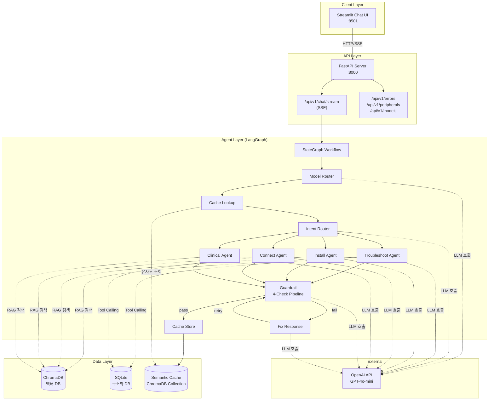
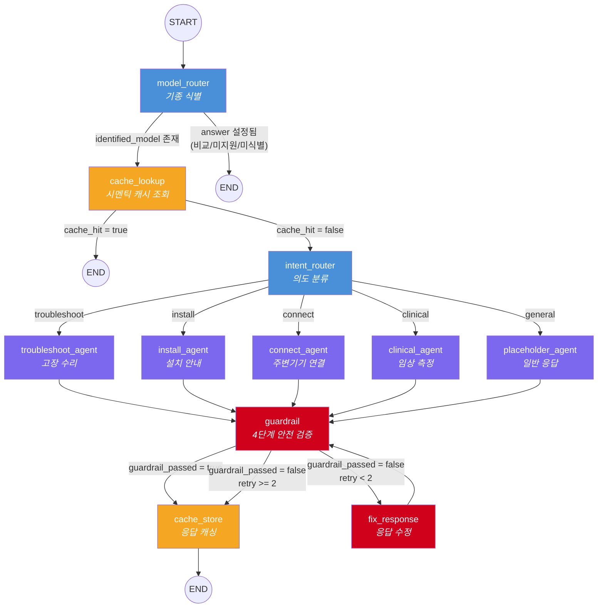
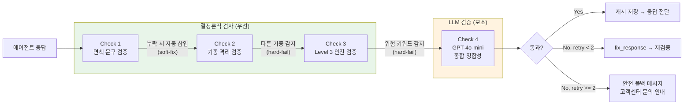
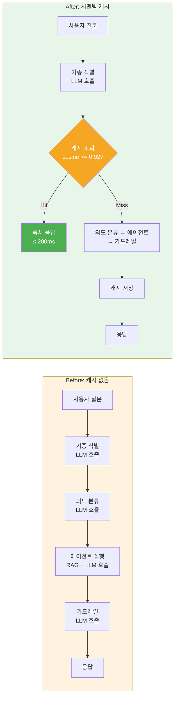
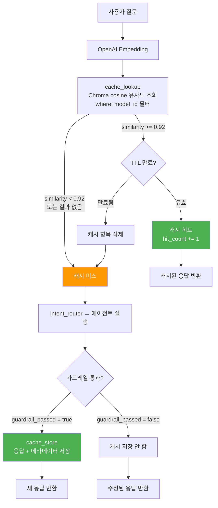

<p align="center">
  <h1 align="center">InBody Multi-Model Technical Support Agent</h1>
  <p align="center">
    LangGraph 기반 멀티 에이전트 기술 지원 시스템 — InBody 체성분 분석기 4개 기종(270S, 580, 770S, 970S)에 대한<br/>기종 식별, 의도 분류, RAG 검색, 안전 검증을 자동화하는 AI 에이전트
  </p>
</p>

<p align="center">
  
  
  
  
  
  
  
  
  
  
  
</p>

---

## Pain Point & Solution

### 문제 인식

InBody 체성분 분석기 4개 기종(270S, 580, 770S, 970S)은 기종마다 별도의 매뉴얼이 존재하며, 설치 방법, 주변기기 호환성, 통신 방식이 각각 다르다.

- **기종별 매뉴얼을 직접 탐색해야 하는 불편함** — 문제 발생 시 해당 기종의 PDF 매뉴얼에서 관련 섹션을 직접 찾아야 함
- **기종을 특정하지 않으면 정확한 안내가 어려움** — 기종별로 호환 프린터, 연결 방식, 에러 대응이 다르므로 기종 식별이 선행되어야 함
- **Level 3 하드웨어 문제에 대한 안전 안내 필요** — 메인보드·센서 등 전문 서비스가 필요한 문제는 반드시 서비스센터를 안내해야 함

### 데이터 출처

| 데이터 | 출처 |
|--------|------|
| 기종별 매뉴얼, 측정 주의사항, 프린터 호환리스트 | [InBody 공식 자료실](https://www.inbody.co.kr/download_center)에서 PDF 수집 |
| 에러코드, 주변기기 호환표 | 에이전트 워크플로우 검증을 위한 샘플 데이터 (생성형 AI 활용) |

### 해결 접근

| Pain Point | 해결 | 구현 |
|------------|------|------|
| 기종별 매뉴얼 탐색 불편 | RAG로 관련 섹션만 검색 + Tool Calling으로 에러코드 정확 조회 | ChromaDB 벡터 검색 + SQLite 구조화 조회 |
| 기종 미특정 시 부정확한 안내 | 텍스트 기반 기종 자동 식별 + 3계층 격리 | `model_router` + 물리/논리/후처리 격리 |
| Level 3 안전 안내 | 위험 키워드 탐지 → 자동 차단 + 서비스센터 안내 | 가드레일 Check 3 + HARDWARE_DISCLAIMER |
| 반복 질문 비용 | 시멘틱 캐시로 유사 질문 즉시 응답 (< 200ms) | cosine 0.92 캐시 + 의도별 TTL |
| 운영 비용 | EC2 프리 티어 + 평일만 운영 | CloudFormation 스케줄러 (프리 티어 기간 중 거의 무료) |

---

## 핵심 기능

- **텍스트 기반 기종 자동 식별** — 사용자 질문에서 InBody 기종(270S/580/770S/970S)을 자동 판별
- **5개 전문 에이전트 라우팅** — 설치, 연결, 고장수리, 임상, 일반 의도별 전문 에이전트로 분류
- **하이브리드 데이터 접근** — RAG(PDF 매뉴얼 벡터 검색) + Tool Calling(에러코드·주변기기 DB 조회) 병행
- **3계층 기종 격리** — 물리적(컬렉션) + 논리적(메타데이터 필터) + 후처리(가드레일) 격리로 기종 간 정보 오염 0%
- **4단계 가드레일** — 면책 문구 자동 삽입 → 기종 누출 감지 → Level 3 안전 차단 → LLM 정합성 검증
- **시멘틱 캐시** — 의미적 유사도 기반 응답 캐싱, 기종 격리 + 의도별 TTL 차등 적용
- **SSE 실시간 스트리밍** — FastAPI → Streamlit 토큰 단위 스트리밍
- **프리 티어 AWS 배포** — EC2 t3.micro + systemd + CloudFormation 스케줄러(평일 09-19시 자동 운영)

---

## 시스템 아키텍처



---

## LangGraph Agent Workflow

11개 노드, 4개 조건부 엣지로 구성된 워크플로우 전체 흐름:



**상태 관리**: `AgentState` (TypedDict, 17개 필드) — 기종 식별, 의도, RAG 결과, 에러코드, 톤앤매너, 가드레일 상태, 캐시 상태를 노드 간 공유

---

## 3계층 기종 격리

InBody 4개 기종의 정보가 절대 섞이지 않도록 3중 방어:

```mermaid
graph LR
    subgraph Layer1 ["Layer 1: 물리적 격리"]
        C1[(inbody_270s<br/>Collection)]
        C2[(inbody_580<br/>Collection)]
        C3[(inbody_770s<br/>Collection)]
        C4[(inbody_970s<br/>Collection)]
    end

    subgraph Layer2 ["Layer 2: 논리적 격리"]
        F["메타데이터 필터<br/>where: {model: '770S'}"]
    end

    subgraph Layer3 ["Layer 3: 후처리 격리"]
        G["가드레일 검증<br/>regex: InBody 다른기종 감지<br/>→ hard-fail"]
    end

    Q["사용자 질문<br/>InBody 770S 에러 E001"] --> Layer1
    Layer1 -->|"770S 컬렉션만 접근"| Layer2
    Layer2 -->|"model=770S 필터"| R[RAG 검색 결과]
    R --> A[에이전트 응답 생성]
    A --> Layer3
    Layer3 -->|"다른 기종 언급 없음 확인"| SAFE[안전한 응답]
    Layer3 -->|"기종 누출 감지"| BLOCK[응답 차단 → 수정]

    style Layer1 fill:#E8F5E9
    style Layer2 fill:#E3F2FD
    style Layer3 fill:#FFF3E0
```



---

## 4단계 가드레일 파이프라인

모든 에이전트 출력은 4단계 안전 검증을 통과해야 사용자에게 전달:



| Check | 유형 | 동작 | 실패 시 |
|-------|------|------|---------|
| 1. 면책 문구 | 결정론적 | MEDICAL/HARDWARE_DISCLAIMER 존재 확인 | 자동 삽입 (soft-fix) |
| 2. 기종 격리 | 결정론적 | `InBody {다른기종}` regex 매칭 | hard-fail → fix_response |
| 3. Level 3 안전 | 결정론적 | "분해", "직접 수리" 등 8개 키워드 탐지 | hard-fail → fix_response |
| 4. LLM 정합성 | GPT-4o-mini | 기종·의도 적합성 종합 판단 | hard-fail → fix_response |

---

## 시멘틱 캐시 — 비용/지연 최적화

기술 지원 질문의 상당수는 동일 에러코드에 대한 반복 문의다. 매번 LLM을 호출하면 비용이 누적되고 응답이 지연된다. ChromaDB 기반 시멘틱 캐시를 도입하여 **의미적으로 동일한 질문은 LLM 호출 없이 즉시 응답**하도록 설계했다.

### Before vs After



- **cosine 유사도 0.92** 임계값으로 표현이 다른 동일 질문도 캐시 히트
- **기종별 격리** — `model_id` 필터로 270S 캐시가 580 질문에 히트되는 교차 오염 방지
- **의도별 TTL 차등** — troubleshoot(7일)부터 clinical(90일)까지, 정보 변경 빈도에 따라 캐시 수명 차등
- **안전 캐싱** — `guardrail_passed = true`인 응답만 캐싱하여 검증 실패 응답이 재사용되는 것을 방지

> **결과**: 캐시 히트 시 응답 지연 **<=200ms** 달성 · 캐시 히트율 **100%** (10/10) · 교차 오염 **0%** (25/25)

### 캐시 상세 흐름



**의도별 TTL 차등:**

| 의도 | TTL | 이유 |
|------|-----|------|
| troubleshoot | 7일 | 에러코드 해결 방법이 업데이트될 수 있음 |
| connect | 14일 | 주변기기 호환성 정보 변경 가능 |
| install | 30일 | 설치 절차는 상대적으로 안정적 |
| general | 30일 | 일반 정보도 비교적 안정적 |
| clinical | 90일 | 측정 원리·해석은 거의 변하지 않음 |

---

## 기술 스택

| 분류 | 기술 | 버전 | 용도 |
|------|------|------|------|
| **AI Orchestration** | LangGraph | >=0.2 | 멀티 에이전트 StateGraph 워크플로우 |
| **LLM** | OpenAI GPT-4o-mini | - | 전 노드 통일 (비용 최적화) |
| **Embedding** | OpenAI text-embedding-ada-002 | - | RAG + 시멘틱 캐시 벡터화 |
| **Vector DB** | ChromaDB | >=0.5 | 매뉴얼 RAG + 시멘틱 캐시 저장 |
| **Structured DB** | SQLite (aiosqlite) | >=0.20 | 에러코드·주변기기 DB |
| **Backend** | FastAPI | >=0.115 | REST API + SSE 스트리밍 |
| **Frontend** | Streamlit | >=1.40 | 채팅 UI |
| **Container** | Docker Compose (로컬) / systemd (EC2) | - | 로컬: Docker, EC2: venv + systemd |
| **Cloud** | AWS EC2 (t3.micro, 프리 티어) | - | 평일 09-19시 자동 운영 |
| **IaC** | CloudFormation | - | EventBridge + Lambda 스케줄러 |
| **Testing** | pytest | >=8.0 | 444 테스트, 커스텀 SC 메트릭 |
| **Linting** | Ruff | >=0.8 | Python 린팅 (line-length=100) |

> 상세 기술 선택 근거는 [docs/techStack.md](docs/techStack.md) 참조

---

## 성공 기준 달성 현황

444개 테스트 케이스, 전체 SC 메트릭 100% PASS:

| SC | 메트릭 | 케이스 | 달성률 | 목표 | 결과 |
|----|--------|--------|--------|------|------|
| SC-001 | 기종 식별 정확도 | 51/51 | 100.0% | >= 95% | **PASS** |
| SC-003 | 에러코드 해결 정확도 | 32/32 | 100.0% | >= 90% | **PASS** |
| SC-004 | 의료 면책 문구 포함 | 12/12 | 100.0% | = 100% | **PASS** |
| SC-005 | 기종 간 정보 격리 | 16/16 | 100.0% | = 100% | **PASS** |
| SC-006 | Level 3 안전 차단율 | 24/24 | 100.0% | = 100% | **PASS** |
| SC-009 | 할루시네이션 방지율 | 21/21 | 100.0% | = 100% | **PASS** |
| SC-010 | 캐시 히트율 | 10/10 | 100.0% | >= 60% | **PASS** |
| SC-011 | 캐시 응답 지연 | 8/8 | 100.0% | = 100% | **PASS** |
| SC-012 | 캐시 교차 오염 | 25/25 | 100.0% | = 100% | **PASS** |

---

## 프로젝트 구조

```
InBody-Multi-Model-Technical-Support-Agent/
├── src/
│   ├── main.py                    # FastAPI 앱 진입점
│   ├── config.py                  # pydantic-settings 설정
│   ├── api/                       # API 라우터 (chat, errors, peripherals, health, ...)
│   ├── graph/
│   │   ├── workflow.py            # LangGraph StateGraph 정의 (11 노드)
│   │   ├── edges.py               # 조건부 라우팅 함수 (4개)
│   │   └── nodes/                 # 에이전트 노드 구현
│   │       ├── model_router.py    # 기종 식별
│   │       ├── intent_router.py   # 의도 분류
│   │       ├── troubleshoot_agent.py
│   │       ├── install_agent.py
│   │       ├── connect_agent.py
│   │       ├── clinical_agent.py
│   │       ├── guardrail.py       # 4-check 가드레일
│   │       ├── cache_node.py      # 캐시 lookup/store
│   │       └── fix_response       # 가드레일 위반 수정
│   ├── models/
│   │   ├── state.py               # AgentState (18 필드)
│   │   └── inbody_models.py       # 기종 정의
│   ├── rag/
│   │   ├── vectorstore.py         # ChromaDB 래퍼 + 3계층 격리
│   │   └── ingest.py              # PDF → 청크 → 벡터 저장
│   ├── cache/
│   │   └── semantic_cache.py      # 시멘틱 캐시 (cosine 0.92)
│   ├── tools/                     # LangChain Tool Calling
│   │   ├── error_code_tool.py
│   │   ├── peripheral_tool.py
│   │   └── manual_search_tool.py
│   ├── db/                        # SQLAlchemy + async
│   └── prompts/                   # 시스템 프롬프트, 면책 문구
├── ui/
│   ├── app.py                     # Streamlit 채팅 UI
│   ├── api_client.py              # FastAPI SSE 클라이언트
│   └── components.py              # UI 컴포넌트
├── tests/
│   ├── unit/                      # 224 케이스 (결정론적, API키 불필요)
│   ├── contract/                  # 25 케이스 (API 계약 검증)
│   └── evaluation/                # 195 케이스 (SC 메트릭 평가)
├── data/
│   ├── manuals/                   # 기종별 PDF 매뉴얼
│   ├── seed/                      # 에러코드·주변기기 시드 데이터
│   ├── section_maps/              # 매뉴얼 목차 구조
│   └── chroma/                    # ChromaDB 영속 저장소
├── deploy/
│   ├── ec2-userdata.sh            # EC2 초기 프로비저닝 (venv + systemd)
│   ├── inbody-api.service         # FastAPI systemd unit
│   ├── inbody-ui.service          # Streamlit systemd unit
│   └── scheduler-cfn.yml          # CloudFormation 스케줄러
├── Dockerfile                     # 멀티스테이지 빌드
├── docker-compose.yml             # api + ui 2-서비스
└── pyproject.toml                 # 의존성 + dev/prod 분리
```

---

## Quick Start

### 1. 환경 설정

```bash
git clone https://github.com/sammy0329/InBody-Multi-Model-Technical-Support-Agent.git
cd InBody-Multi-Model-Technical-Support-Agent

python -m venv .venv
source .venv/bin/activate  # Windows: .venv\Scripts\activate

pip install -e ".[dev]"
```

### 2. 환경 변수

```bash
cp .env.example .env
# .env 파일에 OPENAI_API_KEY 설정
```

### 3. 데이터 준비

```bash
python scripts/seed_structured_data.py   # 에러코드·주변기기 DB 시딩
python scripts/ingest_manuals.py         # PDF 매뉴얼 → ChromaDB 인제스트
```

### 4. 서버 실행

```bash
# API 서버
uvicorn src.main:app --reload --port 8000

# UI (별도 터미널)
streamlit run ui/app.py --server.port 8501
```

---

## 테스트

```bash
# 전체 테스트 (API 키 불필요)
pytest tests/ -v

# SC 메트릭별 실행
pytest -m sc001 -v    # 기종 식별
pytest -m sc003 -v    # 에러코드 해결
pytest -m sc005 -v    # 기종 격리
pytest -m sc010 -v    # 캐시 히트율
pytest -m sc012 -v    # 캐시 교차 오염

# 커버리지
pytest tests/ --cov=src --cov-report=term-missing
```

> 모든 테스트는 `ChatOpenAI` mock + 인메모리 DB를 사용하여 **OpenAI API 키 없이** 실행 가능

---

## 배포

### Docker Compose (로컬)

```bash
docker compose build
docker compose up -d

# API: http://localhost:8000
# UI:  http://localhost:8501
```

### AWS EC2

```bash
# EC2 t3.micro (프리 티어) + venv + systemd
# deploy/ec2-userdata.sh로 자동 프로비저닝 (Docker 미사용)

# 데이터 전송 (로컬 → EC2)
scp -i my-keypair.pem .env ubuntu@<EC2_IP>:~/InBody-Multi-Model-Technical-Support-Agent/
scp -i my-keypair.pem -r data/chroma/ ubuntu@<EC2_IP>:~/InBody-Multi-Model-Technical-Support-Agent/data/
scp -i my-keypair.pem data/inbody.db ubuntu@<EC2_IP>:~/InBody-Multi-Model-Technical-Support-Agent/data/

# 서비스 시작
sudo systemctl start inbody-api inbody-ui

# CloudFormation 스케줄러 (평일 09-19시 KST)
aws cloudformation deploy \
  --template-file deploy/scheduler-cfn.yml \
  --stack-name inbody-scheduler \
  --capabilities CAPABILITY_IAM
```

---

## 문서

| 문서 | 설명 |
|------|------|
| [기술 스택 상세](docs/techStack.md) | 기술 선택 근거 및 아키텍처 결정 기록 |
| [테스트 리포트](docs/test-report.md) | 444 테스트 상세 결과 |
| [배포 가이드](docs/deployment-guide.md) | Docker / EC2 / CloudFormation 배포 |
| [기능 명세](specs/001-inbody-tech-master/spec.md) | 7 User Stories, 32 FR, 12 SC |
| [구현 계획](specs/001-inbody-tech-master/plan.md) | 아키텍처 설계 및 구현 전략 |
| [데이터 모델](specs/001-inbody-tech-master/data-model.md) | AgentState, DB 스키마, 벡터 스토어 설계 |
| [API 계약](specs/001-inbody-tech-master/contracts/api-contract.md) | REST API + Tool Calling 계약 |
| [기술 리서치](specs/001-inbody-tech-master/research.md) | Phase 0 기술 조사 보고서 |

---

## License

MIT License — see [LICENSE](LICENSE) for details.
